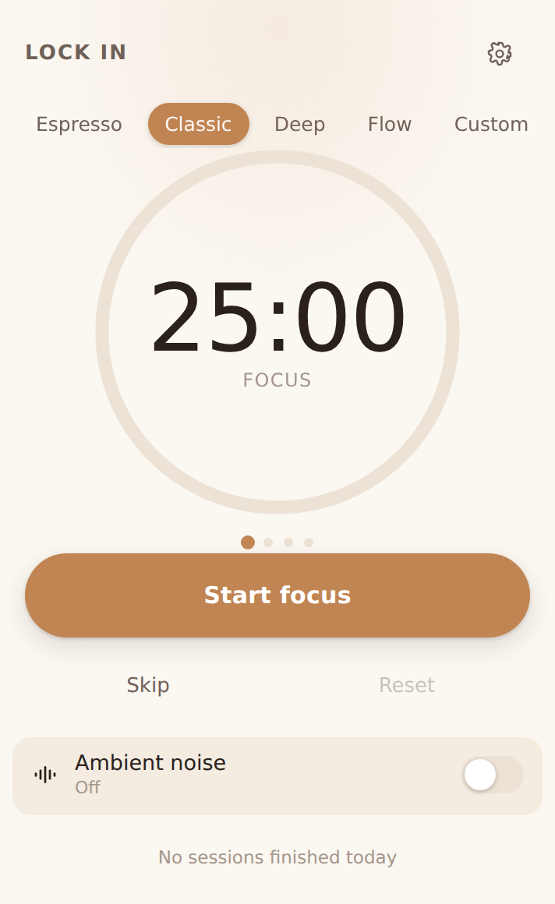
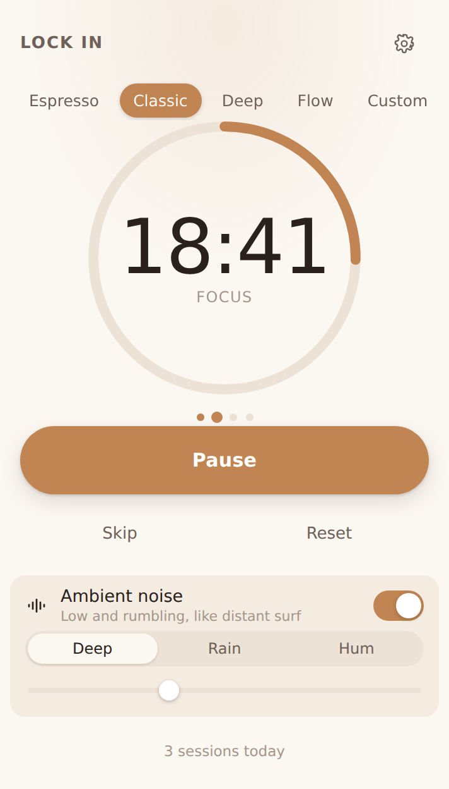
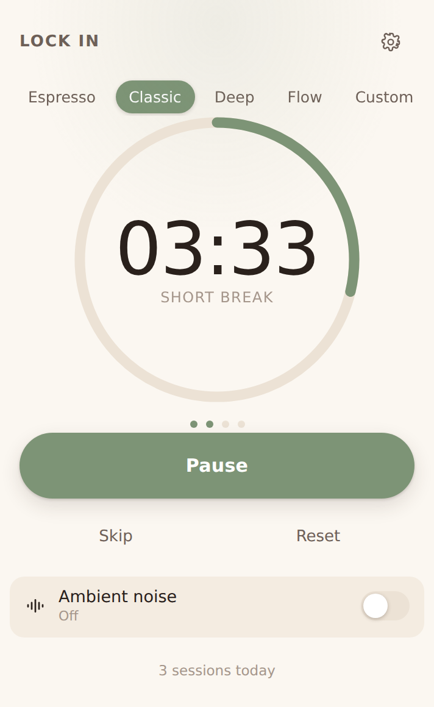

<div align="center">


# Lock In

**A calm focus timer that lives in your menu bar.**

Free and open source. No account, no subscription, no paywall, no adverts,
no telemetry. Every feature is in the app the moment you install it.

</div>

<div align="center">



</div>

## Why

Focus timers are about the simplest software there is, and somehow most of
them want a subscription, an account, or your attention. The alternative — a
timer on a website — means opening a browser, which is where focus goes to
die.

Lock In sits in the menu bar, counts down, and makes a pleasant sound. That is
the whole product, and it should not cost anything.

## What it does

- **Five timer lengths.** Espresso (15/3), Classic (25/5), Deep (50/10),
  Flow (90/20), and a Custom one you set yourself.
- **A countdown in the menu bar**, shown only while a session is actually
  running. An idle timer is a quiet one.
- **A chime at each boundary**, synthesised rather than sampled: a soft bell,
  a singing bowl or a wooden block. Focus ends on a lower note than a break,
  so you can tell them apart without looking.
- **White, pink or brown noise** while you work, with volume and a tone
  control that runs from muffled and distant to fully open. It fades in and
  out, never loops, and stops on its own when the session does.
- **Breaks that start themselves** — and focus that does not, unless you ask.
- **Light and dark**, following the system or pinned either way.

Nothing leaves your machine. There is no network code in the app at all; the
only outbound action is opening this page in your browser when you tap the
link in Settings. See [PRIVACY.md](PRIVACY.md).

## Install

> [!IMPORTANT]
> Version 0.1 is **untested on real hardware.** The logic is covered by tests
> and both desktop builds pass CI, but nobody has yet run it on a physical Mac
> or PC. Treat the first release as a beta and please report what breaks.

| Platform | Status |
| --- | --- |
| macOS 10.15+ | Builds and bundles, needs testing |
| Windows 11 | Builds in CI, needs testing |
| Linux | Builds from source |
| Android / iOS | Planned — see [DISTRIBUTION.md](docs/DISTRIBUTION.md) |

Download from [Releases](../../releases). The icon appears in the menu bar or
system tray; on macOS there is deliberately no dock icon.

**Both platforms will warn you on first launch**, because the builds are not
code-signed — certificates cost money and this app is free. The app is not
broken; your OS simply cannot verify who built it.

- **macOS** says it "is damaged and can't be opened". Clear the quarantine
  flag once:
  ```sh
  xattr -cr "/Applications/Lock In.app"
  ```
- **Windows** shows a SmartScreen wall. Choose **More info → Run anyway**.

If you would rather not take that on faith, building it yourself takes about
five minutes.

## Build from source

You need [Rust](https://rustup.rs) and [Node 20+](https://nodejs.org). On
macOS also `xcode-select --install`; on Linux also
`libwebkit2gtk-4.1-dev libasound2-dev libgtk-3-dev librsvg2-dev`.

```sh
git clone https://github.com/PonyGShock/Lock-In-Timer.git
cd Lock-In-Timer
npm install
npm run icons      # renders the icon set from app-icon.png
npm run app        # development build
npm run app:build  # release build
```

### Working on the interface

The UI runs in an ordinary browser against a stand-in backend, which is much
faster than rebuilding the app for a spacing change:

```sh
npm run dev        # http://localhost:1420
```

Query parameters seed a state to design against, which is also how the
screenshots above were made:

```
?state=running&remaining=1122&round=2&done=3&noise=1&theme=dark
```

### Tests

```sh
cargo test -p lockin-core   # timer, synthesis and settings
npm run build               # typecheck and bundle the UI
```

## How it works

```
crates/lockin-core     no system dependencies, all the logic worth testing
  timer.rs             the phase state machine, driven by an injected clock
  noise.rs             white / pink / brown generators and the fade envelope
  chime.rs             additive synthesis of the boundary chimes
  settings.rs          the settings file, its clamping and its migrations
src-tauri              the desktop app
  engine.rs            owns the timer and decides what should be audible
  audio.rs             a thread owning the output device, fed over a channel
  tray.rs              menu bar icon, title and menu (desktop only)
src                    the React interface
```

Two decisions are worth knowing about before contributing:

**The timer lives in Rust, not in the webview.** The window is a view onto
state the backend owns, so the countdown keeps time whether the popover is
open, hidden, or has never been opened. The engine takes `now` as an argument
rather than reading the clock, which is what makes its behaviour testable to
the millisecond — including what happens when a laptop sleeps through the end
of a session.

**All audio is synthesised at runtime.** There are no audio files in this
repository. Noise is generated sample by sample, so it never loops and the
installer stays small; the chimes are sums of decaying partials at inharmonic
ratios, which is what makes a struck bell sound struck. It also means there is
no sample licence for anyone to trip over when they fork this.

## Roadmap

1. Test 0.1 on real macOS and Windows machines and fix what falls out.
2. Android, through F-Droid first — the only store route that costs nothing
   and the natural home for an app like this.
3. iOS, which needs an Apple Developer membership.
4. A global shortcut to start and pause from anywhere.

The mobile ports need more than a recompile: a phone suspends your process, so
the timer has to schedule its end rather than count towards it, and background
audio needs platform-specific handling. [DISTRIBUTION.md](docs/DISTRIBUTION.md)
spells out what is involved and what each store costs.

## Contributing

Issues and pull requests are welcome — see [CONTRIBUTING.md](CONTRIBUTING.md).
If you want a feature, say so. The point of this project is that nobody has to
pay to get their timer to work properly.

## License

[GPL-3.0-or-later](LICENSE). You can use, study, change and share it. If you
distribute a modified version it has to stay free in the same way, which is
the entire reason for choosing this licence over something more permissive:
nobody should be able to take this, close it, and start charging for it.
